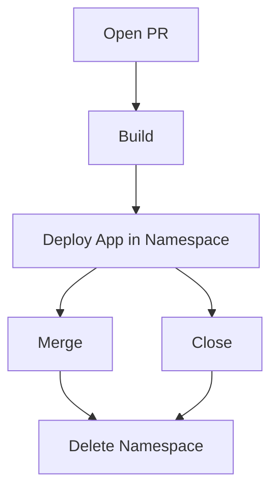

# maktouch/namespace-cleaner

Prunes Kubernetes namespaces based on a repo's Github PR 

Dockerhub: https://hub.docker.com/r/maktouch/namespace-cleaner

## Why? 



When a PR opens, we start the build, which takes a few minutes. After that, it gets deployed to our review cluster, in a dedicated namespace. Once the PR is merged or closed, an action triggers the deletion. 

Unfortunately, some people sometimes merges a PR before the builds has completed; so the `Delete namespace` action triggers, and then a few minutes later, the build and deploy finishes, and we find ourselves with a zombie namespace that never gets killed, and takes resources for nothing. 

This solves that by comparing namespaces with PRs. If it's not in the open PR list, it deletes the namespace in Kubernetes. 

## How to run

Since it's made to interface with Kubernetes, it's only logical that you run this in Kubernetes as a CronJob. I suggest you run it with the correct RBAC and service name. 

```yaml
apiVersion: batch/v1
kind: CronJob
metadata:
  name: namespace-cleaner
spec:
  successfulJobsHistoryLimit: 1
  failedJobsHistoryLimit: 1
  schedule: '0 */2 * * *'
  concurrencyPolicy: Forbid 
  jobTemplate:
    spec:
      template:
        metadata:
          labels:
            app: namespace-cleaner
        spec:
          restartPolicy: OnFailure
          serviceAccountName: namespace-cleaner
          containers:
            - name: namespace-cleaner
              image: 'maktouch/namespace-cleaner:latest'
              imagePullPolicy: Always
              env:
                - name: GITHUB_REPOSITORY
                  value: 'org/repo'
                - name: GITHUB_TOKEN
                  value: '<secret>'
                - name: K8S_CREDENTIALS
                  value: '<secret>'
              resources:
                requests:
                  cpu: 50m
                  memory: 64M

---

```yaml
apiVersion: v1
kind: ServiceAccount
metadata:
  name: namespace-cleaner

---

apiVersion: rbac.authorization.k8s.io/v1
kind: ClusterRole
metadata:
  name: namespace-cleaner-role
rules:
- apiGroups:
  - ""
  - extensions
  - apps
  resources:
  - namespaces
  verbs:
  - get
  - watch
  - delete
  - list
- nonResourceURLs:
  - '*'
  verbs:
  - get
  - watch
  - list

---
apiVersion: rbac.authorization.k8s.io/v1
kind: ClusterRoleBinding
metadata:
  name: namespace-cleaner-role-binding
roleRef:
  apiGroup: rbac.authorization.k8s.io
  kind: ClusterRole
  name: cluster-admin
subjects:
- kind: ServiceAccount
  name: namespace-cleaner
```

```


## Configuration

| env | description | required | default |
| --- | ------------| ---------| --------|
| GITHUB_REPOSITORY | The Github Repo in ORGANIZATION/REPO format | yes | -
| GITHUB_TOKEN | The Github Personal Token | yes | -
| K8S_CREDENTIALS | The Kubernetes credentials in YAML or JSON. I suggest you use RBAC instead | no | -
NAMESPACE_REGEX | The namespace format. By default, it looks for namespaces that looks like `rev-{some-digits}`. This is how you change the pattern. Make sure you escape the regex properly. | no | `rev-(\\d+)`
NAMESPACE_BLACKLIST | Maybe you want to project a PR. This is how you do it. It's comma-separated, like `rev-1,rev-3` | no | -
